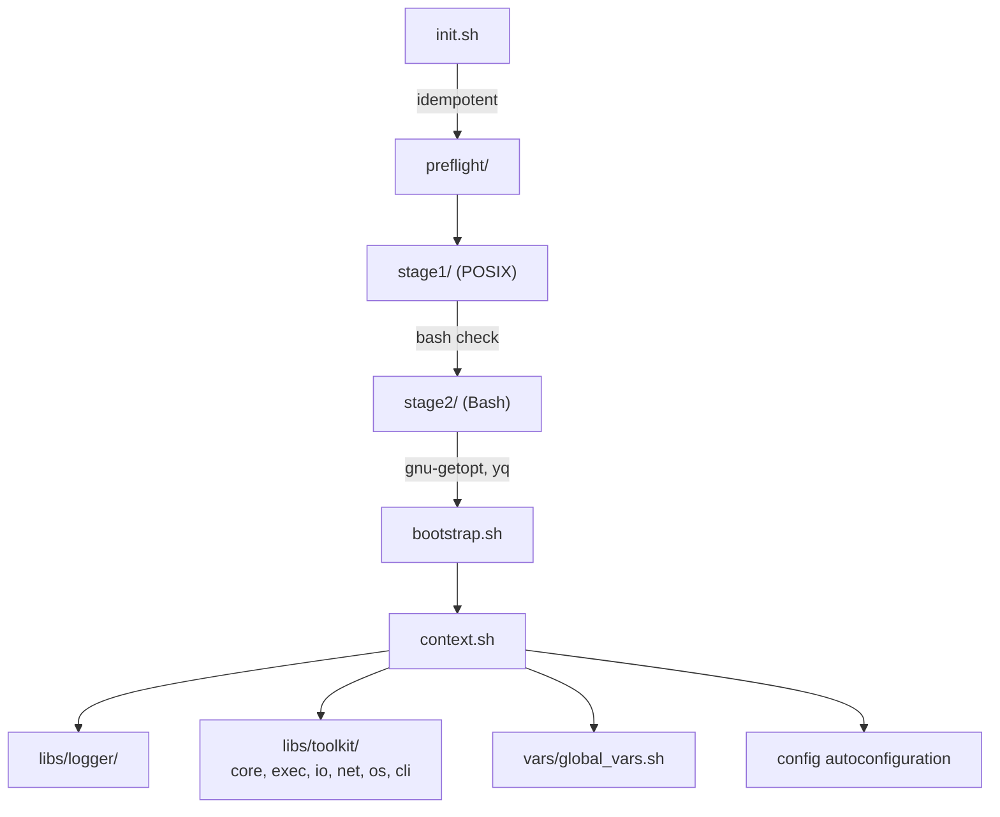
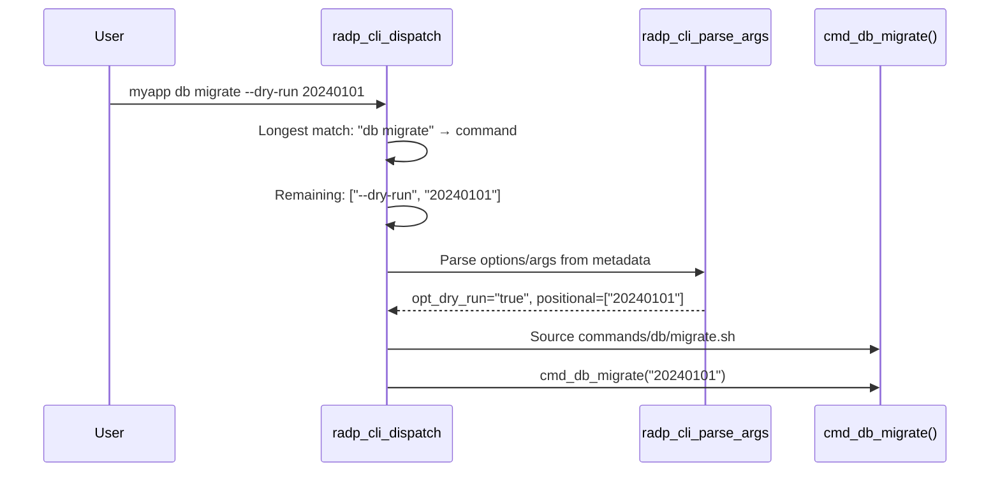

# Architecture

This document describes the internal architecture of radp-bash-framework.

## Execution Flow



## Preflight Two-Stage Design

The framework uses a two-stage preflight system to check and install dependencies:

```
preflight/
├── preflight.sh              # Entry point, orchestrates stages
├── stage1/                   # POSIX shell (bash check only)
│   ├── stage1.sh             # Stage 1 main
│   └── bash.sh               # Bash version check/install
└── stage2/                   # Bash (other dependencies)
    ├── stage2.sh             # Stage 2 main
    ├── lib.sh                # Common utilities
    ├── gnu_getopt.sh         # GNU getopt check/install
    └── yq.sh                 # yq check/install
```

**Why two stages?**

- **Stage 1** runs in POSIX shell to bootstrap bash itself (can't use bash features before bash is confirmed)
- **Stage 2** runs in bash after stage 1 completes, allowing cleaner code with `local`, `[[ ]]`, arrays, etc.

**Adding a new dependency:**

1. Create `stage2/<name>.sh` with `__check_<name>()` and `__install_<name>()` functions
2. Add entry to `__REQUIREMENTS` array in `stage2/stage2.sh`

## Directory Structure

```
src/main/shell/
├── bin/radp-bf                           # CLI entry point
├── framework/
│   ├── init.sh                           # Framework initializer
│   ├── preflight/                        # Dependency checking
│   │   ├── stage1/                       # POSIX shell stage
│   │   └── stage2/                       # Bash stage
│   └── bootstrap/
│       ├── bootstrap.sh                  # Context builder
│       └── context/
│           ├── context.sh                # Context loader
│           ├── libs/
│           │   ├── logger/               # Logging system
│           │   └── toolkit/              # Utility functions
│           │       ├── core/             # Variables, arrays, strings
│           │       ├── exec/             # Command execution
│           │       ├── io/               # File operations
│           │       ├── net/              # Network utilities
│           │       ├── os/               # OS detection
│           │       └── cli/              # CLI infrastructure
│           └── vars/
│               └── global_vars.sh        # Variable declarations
├── config/
│   ├── framework_config.yaml             # Framework defaults
│   └── banner.txt                        # Default banner
└── commands/                             # radp-bf commands
    ├── new.sh                            # radp-bf new
    ├── upgrade.sh                        # radp-bf upgrade
    ├── path.sh                           # radp-bf path
    └── completion.sh                     # radp-bf completion
```

## Configuration Layering

Configuration is loaded in this order (later overrides earlier):

1. `framework_config.yaml` - Framework defaults
2. User `config.yaml` - Overrides via `radp.fw.*` or `radp.extend.*`
3. Environment variables - `GX_RADP_FW_*` prefix (override any config)
4. Final config cached in `cache/final_config.sh`

## Sourcing & Load Order

- `__fw_source_scripts` sources all `.sh` files in a directory
- Files sorted by numeric prefix: `1_feature.sh`, `2_other.sh`
- Sourced files recorded in `gwxa_fw_sourced_scripts` array

## CLI Command Discovery

Commands are auto-discovered from the `commands/` directory:

```
commands/
├── version.sh              # Top-level: mycli version
├── vf/
│   ├── init.sh             # Subcommand: mycli vf init
│   ├── list.sh             # Subcommand: mycli vf list
│   └── template/
│       ├── list.sh         # Nested: mycli vf template list
│       └── show.sh         # Nested: mycli vf template show
```

### Command File Requirements

- Must contain `# @cmd` marker to be discovered
- Function name follows path: `commands/vf/init.sh` → `cmd_vf_init()`
- Files starting with `_` are ignored (internal use)

### Dispatch Flow



## Toolkit Domains

The toolkit is organized into 6 domains under `libs/toolkit/`:

| Domain | Description |
|--------|-------------|
| **core** | Variables, arrays, maps, strings, version comparison |
| **exec** | Command execution with logging, retry strategies, dry-run mode |
| **io** | File operations, interactive prompts, text banners |
| **net** | Connectivity checks, interface queries, SSH operations |
| **os** | Distro detection, security (SELinux/firewall), user management |
| **cli** | Argument parsing, help generation, command dispatch |

## Key Design Decisions

1. **Idempotent Initialization** - `init.sh` can be sourced multiple times safely via `gw_fw_run_initialized` flag

2. **POSIX-first Preflight** - Stage 1 uses POSIX shell for maximum compatibility before bash is confirmed

3. **Convention over Configuration** - Default paths, names, and behaviors follow predictable patterns

4. **Layered Configuration** - Framework defaults → App config → Env config → Environment variables

5. **Auto-discovery** - Commands and libraries are discovered from directory structure

## See Also

- [Code Style](./code-style.md) - Naming conventions and coding standards
- [API Reference](../reference/api.md) - Complete function reference
